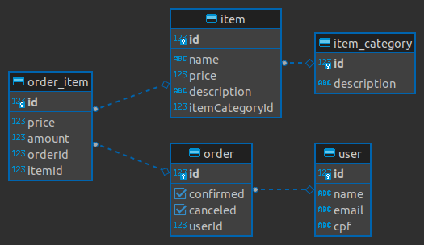

# Teste Hoobox - Backend 

## Tecnologias Utilizadas

* Typescript
* Express
* PostgreSQL
* TSyringe (Injeção de dependências)

## Instrução para rodar
O projeito foi construído utilizando o docker como ambiente, para subir a API e o banco basta utilizar o comando no diretório raiz do projeto:

```
docker-compose up
```

E então a API será iniciada na porta 3000.

## Funcionalidades Implementadas

* Adicionar usuários 
</br>([POST] /users)

* Listar produtos 
</br>([GET] /items)
* Listar compras por usuários 
</br>([GET] /orders/?user=userId)

* Realizar uma compra 
</br>([PATCH] /confirm?id=orderId)
* Editar uma compra 
</br> ([POST] /orders/order_item) 
</br>([DELETE] /order_item?id=order_item_id)

* Cancelar uma compra 
</br> ([PATCH] /cancel?id=orderId)
* Realizar busca de item por categoria
</br> ([GET] /items/filter?id=categoryId)
* Histórico de compras do usuário
</br> ([GET] /orders/?user=userId)

</br>

### Link para importar a collection no Postman
</br>

https://www.getpostman.com/collections/0787e1fd197fcd784490

</br>

## Criando Entidades no banco
Criando um novo usuário. 

Endpoint: /users

```
{
	"name":"Lucas",
	"email":"lucas1@email.com",
	"cpf":"113.323.931-33"
}
```

Criando entidade de Order (compra).

Endpoint: /orders

```
{
    "user": {userId: number}
}
```

Criando uma categoria de produtos.

Endpoint: /items/category

```
{
	"description": "Celulares"
}
```

Vinculando um item (produto) a uma categoria.

Endpoint: /items

```
{
	"name":"Iphone 14",
	"price": 3000,
	"description": "Smarthphone",
	"category": {categoryId: number}
}
```

Adicionando items (produtos) a uma order (compra).

Endpoint: orders/order_item

```
{
	"order": {orderId: number},
	"amount": 2,
	"item": {itemId: number}
}
```

Removendo items (produtos) de uma order (compra).

Endpoint: orders/orders/order_item?id=2

Onde o id passado é o da entidade order_item, tabela intermediária 
que vincula um produto a uma compra.

## Diagrama ER
</br>
